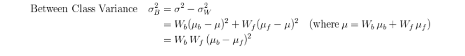

== GÖRÜNTÜ İŞLEME Otsu Metodu +

== 1) İçindekiler +
. İçindekiler +
. Versiyon Geçmişi +
. Giriş +
. Otsu Eşikleme Yöntemi +
. Python ile Otsu Yönteminin Uygulama Örneği +
. Referanslar +

== 2) Versiyon Geçmişi +
|===
|Tarih|Değişiklik|Kişi

|24.08.2015
|Otsu Eşikleme

|Fatma Selin Hangişi
|15.12.2016
 
|Otsu Eşikleme
|M.Sıla Genç, Gönül Toktay

|19.12.2016

|Düzenleme
|Merve Tafralı

|===

== 3) Giriş +

Bu uygulamada görüntü işleme algoritmalarından Otsu eşikleme algoritması kullanılarak görüntünün ikili(binary) hale getirilmesi amaçlanmıştır.
Otsu algoritmasının nasıl çalıştığı,neyi amaçladığı uygulamayla anlatılmıştır. +

== 4) Otsu Eşikleme Yöntemi +

Adını bu metodu geliştiren Nobuyuki Otsu’dan almıştır.Yöntem gri seviye görüntüler üzerinde çalışır ve sadece renklerin görüntü üzerinde kaçar defa bulunduğuna bakar.
Gri seviyedeki bir görüntüyü ikili seviyeye dönüştürülerek kullanılabilecek en uygun eşik değerinin tespitini sağlar.Bu yöntemde, renklerin görüntü üzerinde var olma sayısına bakıldığı için uygulamaların eşik belirleme
adımına geçmeden önce renk histogramı hesaplanır ve tüm hesaplamalar bu histogram üzerinden yapılır.
Otsu algoritması histogramda eşikleme yapılabilecek en uygun konumun bulunması için kullanılır. +
Otsu algoritmasında histogramın her bir elemanını eşik gibi düşünerek her biri için “weight”,”mean” ve ”variance” diye tabir edilen veriler hem eşikten önce(background) 
hem de eşikten sonrası(foreground) için hesaplanır. +
Her bir eleman eşik kabul edilerek her bir eleman için hesaplamalar yapılacağı için belirlenen elemandan öncesi eşik öncesi(background),belirlenen elemandan sonrası eşik sonrası(foreground) olarak adlandırılır. +

Örnekler üzerinden formüllerin kullanışı ve çıkarılması: +

image::otsuOrig.png[] 

yukarıdaki şekilde 6 tonlu bir görüntü ve histogramı bulunmaktadır.

Eşik öncesi değerleri hesaplamak için kullanılan formüller(background): +

*Backgroung*

image::bckground.png[]

*weight(background)=* seçilen histogram elemanına kadar olan elemanların piksel sayıları toplamı(kendisi dahil değil) / toplam piksel sayısı +

image::wb.png[]

*mean(background)=* kendinden önceki her eleman için(histogram elemanı*histogram elemanının değeri) toplamları / seçilen histogram elemanına kadar olan elemanların piksel sayıları toplamı(kendisi dahil değil) +

image::mb.png[] 

*variance(background)=*  kendinden önceki her eleman için ((histogram elemanı-mean(background)) * (histogram elemanı-mean(background)) * histogram elemanının değeri / seçilen histogram elemanına kadar olan elemanların piksel sayıları toplamı(kendisi dahil değil) +

image::vb.png[] 

Eşik sonrası değerleri hesaplamak için kullanılan formüller(foreground): +

image::foreground.png[] 

*weight(foreground)=* seçilen histogram elemanından itibaren elemanların piksel sayıları toplamı(kendisi dahil) / toplam piksel sayısı

image::wf.png[] 

*mean(foreground)=* kendinden sonraki her eleman için(histogram elemanı * histogram elemanının değeri) toplamları / seçilen histogram elemanından itibaren elemanların piksel sayıları toplamı(kendisi dahil) +

image::mf.png[] 

*variance(foreground)=* kendinden sonraki her eleman için ((histogram elemanı-mean(background))*(histogram elemanı-mean(background))*histogram elemanının değeri / seçilen histogram elemanından itibaren elemanların piksel sayıları toplamı(kendisi dahil) +

image::vf.png[]

Bu üretilen “weight”,”mean” ve “variance” değerleri kullanılarak “within class variance” ve “ between class variance” değerleri hesaplanır. +

Yani sınıf içi global varyans ve sınıflar arası global varyans hesaplanır. +

Bu hesaplamalardan elde edilen değerler içerisinden sınıflar arasındaki yoğunluk değerleri için en iyi ayrımı en küçük sınıf içi global 
varyans ya da en büyük sınıflar arası global varyans değerini veren eşik değeri optimum eşik değeri seçilir. +

*within class variance=*  (weight(background) * variance(background)) +(weight(foreground) * variance(foreground)) +

image::sumExample.png[] 

*between class variance=*  weight(background) * weight(foreground) * (mean(background)-mean(foreground)) * (mean(background)-mean(foreground)) +

Eşik seçiminde önce sınıflar arası varyansın(between class variance) maksimum değeri değerlendirilir.
Bu eşiğin öncesinde kalan (background) kısımlardaki değerler “0” diğerleri “1” yani (255) olarak görüntüler düzenlenir. +

== 5) Python ile Otsu Yönteminin Uygulama Örneği +

[[source,python]]
----

import Image                                               #  Bu kod ile “Image” kütüphanesi Kullanılmıştır.

im= Image.open("/home/selin/optik/ap9oic.jpg")             # Burada im değişkenine belirtilen dizindeki görüntü atanmıştır.

pix = im.load()                                            #     pix değişkenine görüntü yüklenmiştir

img = Image.new( 'RGB', (1191,1599), "black")              #  1191*1599 boyutlarında yeni bir boş görüntü oluşturulmuştur.

pixels = img.load()                                        #    pixels değişkenine boş görüntü yüklenmiştir

w=im.size[0]                                               #      w değişkenine çözünürlüğün genişliği atanmıştır

h=im.size[1]                                               #     h değişkenine çözünürlüğün yüksekliği atanmıştır

graylist=[[0]*h for x in range(w)]                         #   graylist adında w*h boyutunda iç içe bir liste oluşturulmuştur.her satır için sütunlar tanımlanmıştır da diyebiliriz. 

for i in range(w):
  for j in range(h):                                       #   iç içe döngü kurularak görüntüyü bir matrise çekmiştir

       r, g, b = im.getpixel((i, j))                       #      matrisin her bir elemanı bir pixeli ifade eder ve burada her pixelin renk değerleri sırasıyla r,g ve b değişkenlerine atanır
       gray=(int)((r*0.2126)+(g*0.7152)+(b*0.0722))        # gray değişkenine ,insan gözünün gama ışınlarını algılama oranlarına göre oluşturulan formüle kırmızı,yeşil ve mavi değerleri yerlerine konarak sekiz bitlik gri tonlarından hangisi o pixel için geçerliyse o atanır.

       graylist[i][j]=gray                                 #     graylist’in [i][j] (piksel değeri) değerine bulunduğu pikselin gri değeri atanmış ve tüm piksellerin ağırlık toplama yöntemi kullanılarak bulunan gri değeri listeye kaydedilmiştir.

       pixels[i,j]=(gray,gray,gray)                        #   görüntünün her pixeli ağırlık toplama yöntemine göre bulunan gri değeri atanır.Kod parçasında görüldüğü gibi standart olarak belirlenen kırmızı,yeşil ve mavi tonlarının oranlarının hepsine aynı değer girilmiştir.Bu gri tonunu elde edebilmek için yapılan işlemdir.

img.save("/home/selin/optik/ap9oic.bmp","bmp")             #   görüntü farklı bir isimle ilk alınan klasöre gri olarak kaydedilmiştir.

