== GÖRÜNTÜ İŞLEME Otsu Metodu +

== 1) İçindekiler +
. İçindekiler +
. Versiyon Geçmişi +
. Giriş +
. Otsu Eşikleme Yöntemi +
. Python ile Otsu Yönteminin Uygulama Örneği +
. Referanslar +

== 2) Versiyon Geçmişi +
|===
|Tarih|Değişiklik|Kişi

|24.08.2015
|Otsu Eşikleme

|Fatma Selin Hangişi
|15.12.2016
 
|Otsu Eşikleme
|M.Sıla Genç, Gönül Toktay

|19.12.2016

|Düzenleme
|Merve Tafralı

|===

== 3) Giriş +

Bu uygulamada görüntü işleme algoritmalarından Otsu eşikleme algoritması kullanılarak görüntünün ikili(binary) hale getirilmesi amaçlanmıştır.Eşikleme ya da ikili tonlama da denilebilir, bu algoritmada amaç gri olarak tonlanmış olan bir görüntünün ikili bir hale getirilmesidir. Bir görüntünün ikili hale getirilmesi demek siyah beyaz uzaya dönüştürülmesi demektir. +
Otsu algoritmasının nasıl çalıştığı,neyi amaçladığı uygulamayla anlatılmıştır. +

== 4) Otsu Eşikleme Yöntemi +

Adını bu metodu geliştiren Nobuyuki Otsu’dan almıştır.Yöntem gri seviye görüntüler üzerinde çalışır ve sadece renklerin görüntü üzerinde kaçar defa bulunduğuna bakar http://www.cescript.com/2012/07/otsu-metodu-ile-adaptif-esikleme.html[[2]].
Gri seviyedeki bir görüntüyü ikili seviyeye dönüştürülerek kullanılabilecek en uygun eşik değerinin tespitini sağlar.Bu yöntemde, renklerin görüntü üzerinde var olma sayısına bakıldığı için uygulamaların eşik belirleme
adımına geçmeden önce renk histogramı hesaplanır ve tüm hesaplamalar bu histogram üzerinden yapılır.
Otsu algoritması histogramda eşikleme yapılabilecek en uygun konumun bulunması için kullanılır. +
Otsu algoritmasında histogramın her bir elemanını eşik gibi düşünerek her biri için “weight”,”mean” ve ”variance” diye tabir edilen veriler hem eşikten önce(background) 
hem de eşikten sonrası(foreground) için hesaplanır. +
Her bir eleman eşik kabul edilerek her bir eleman için hesaplamalar yapılacağı için belirlenen elemandan öncesi eşik öncesi(background),belirlenen elemandan sonrası eşik sonrası(foreground) olarak adlandırılır. +

Örnekler üzerinden formüllerin kullanışı ve çıkarılması: +

image::otsuOrig.png[] 

yukarıdaki şekilde 6 tonlu bir görüntü ve histogramı bulunmaktadır.

Eşik öncesi değerleri hesaplamak için kullanılan formüller(background) http://www.labbookpages.co.uk/software/imgProc/otsuThreshold.html#examples[[1]] : +

*Backgroung*

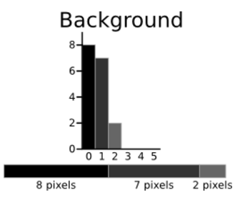

*weight(background)=* seçilen histogram elemanına kadar olan elemanların piksel sayıları toplamı(kendisi dahil değil) / toplam piksel sayısı +

*mean(background)=* kendinden önceki her eleman için(histogram elemanı*histogram elemanının değeri) toplamları / seçilen histogram elemanına kadar olan elemanların piksel sayıları toplamı(kendisi dahil değil) +

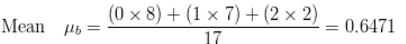 

*variance(background)=*  kendinden önceki her eleman için ((histogram elemanı-mean(background)) * (histogram elemanı-mean(background)) * histogram elemanının değeri / seçilen histogram elemanına kadar olan elemanların piksel sayıları toplamı(kendisi dahil değil) +

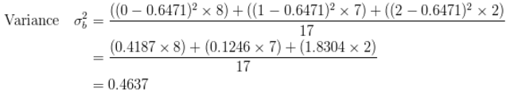 

Eşik sonrası değerleri hesaplamak için kullanılan formüller(foreground): +

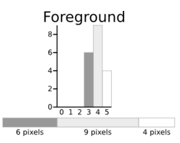 

*weight(foreground)=* seçilen histogram elemanından itibaren elemanların piksel sayıları toplamı(kendisi dahil) / toplam piksel sayısı

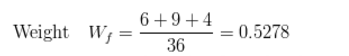 

*mean(foreground)=* kendinden sonraki her eleman için(histogram elemanı * histogram elemanının değeri) toplamları / seçilen histogram elemanından itibaren elemanların piksel sayıları toplamı(kendisi dahil) +

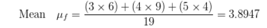 

*variance(foreground)=* kendinden sonraki her eleman için ((histogram elemanı-mean(background))*(histogram elemanı-mean(background))*histogram elemanının değeri / seçilen histogram elemanından itibaren elemanların piksel sayıları toplamı(kendisi dahil) +

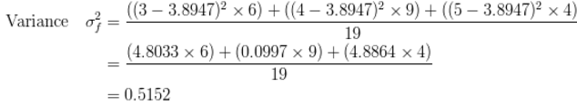

Bu üretilen “weight”,”mean” ve “variance” değerleri kullanılarak “within class variance” ve “ between class variance” değerleri hesaplanır. +

Yani sınıf içi global varyans ve sınıflar arası global varyans hesaplanır. +

Bu hesaplamalardan elde edilen değerler içerisinden sınıflar arasındaki yoğunluk değerleri için en iyi ayrımı en küçük sınıf içi global 
varyans ya da en büyük sınıflar arası global varyans değerini veren eşik değeri optimum eşik değeri seçilir. +

*within class variance=*  (weight(background) * variance(background)) +(weight(foreground) * variance(foreground)) +

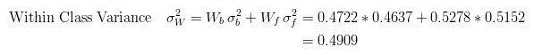 

*between class variance=*  weight(background) * weight(foreground) * (mean(background)-mean(foreground)) * (mean(background)-mean(foreground)) +

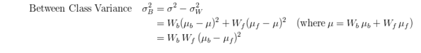

Eşik seçiminde önce sınıflar arası varyansın(between class variance) maksimum değeri değerlendirilir.
Bu eşiğin öncesinde kalan (background) kısımlardaki değerler “0” diğerleri “1” yani (255) olarak görüntüler düzenlenir http://www.atasoyweb.net/Otsu-Esik-Belirleme-Metodu[[3]] . +

== 5) Python ile Otsu Yönteminin Uygulama Örneği +

[source,python]
---------------------------------------------------------------------

import Image
im= Image.open("C:\Users\MERVE\Pictures\m1normal.png")
pix = im.load()
w=im.size[0]
h=im.size[1]
print w , h ;
img = Image.new( 'RGB', (w,h), "black")
pixels = img.load()
graylist=[[0]*h for x in range(w)]
for i in range(w):
  for j in range(h):
       r, g, b = im.getpixel((i, j))
       gray=(int)((r*0.2126)+(g*0.7152)+(b*0.0722))
       graylist[i][j]=gray
       print graylist[i][j]
       pixels[i,j]=(gray,gray,gray)  
img.save("C:\Users\MERVE\Pictures\m1normal_gray.bmp","bmp")
histogram=[0]*256
for m in range (w):
    for n in range(h):
        x=graylist[m][n]
        histogram[x]=histogram[x]+1
def add_back(liste,indis):
    sum_back=0
    for a in range(indis):
        sum_back=sum_back+liste[a]
    return sum_back
def add_fore(liste,indis):
    sum_fore=0
    for b in range(indis,len(histogram)-1,1):
        sum_fore=sum_fore+liste[b]
    return sum_fore
def weight_back(liste,indis):
    wb=float(add_back(liste, indis))/(add_back(liste, len(liste)))
    return wb
def weight_fore(liste,indis):
    wf=float(add_fore(liste,indis))/(add_back(liste,len(liste)))
    return wf
def mean_back(liste,indis):
    mbpay=0
    for d in range (indis-1):
        mbpay=mbpay+(d*liste[d])
    if add_back(liste,indis)==0:
        mb=1
    else:
        mb=float(mbpay)/(add_back(liste,indis))
    return mb
def mean_fore(liste,indis):
    mfpay=0
    for e in range (indis,len(liste)-1,1):
        mfpay=mfpay+(e*liste[e])
    if add_fore(liste,indis)==0:
        mf=1
    else:
        mf=float(mfpay)/(add_fore(liste,indis))
    return mf
def variance_back(liste,indis):
    vbpay=0
    for f in range (indis-1):
        vbpay=vbpay+((f-mean_back(liste,indis))*(f-mean_back(liste,indis))*liste[f])
    if add_back(liste,indis)==0:
        vb=1
    else:
        vb=float(vbpay)/(add_back(liste,indis))
    return vb
def variance_fore(liste,indis):
    vfpay=0
    for g in range (indis,len(liste)-1,1):
        vfpay=vfpay+((g-mean_fore(liste,indis))*(g-mean_fore(liste,indis))*g)
    if add_fore(liste,indis)==0:
        vf=1
    else:
        vf=float(vfpay)/(add_fore(liste,indis))
    return vf
def within_class_variance(liste,indis):
    wcv=(weight_back(liste,indis)*variance_back(liste,indis))+(weight_fore(liste,indis)*variance_fore(liste,indis))
    return wcv
def between_class_variance(liste,indis):
    bcv=(weight_back(liste,indis)*weight_fore(liste,indis)*(mean_back(liste,indis)-mean_fore(liste,indis))*(mean_back(liste,indis)-mean_fore(liste,indis)))
    return bcv  
wcv=([0])*256
for z in range (len(histogram)-1):
    wcv[z]=within_class_variance(histogram,z)
bcv=([0])*256
for u in range (len(histogram)-1):
    bcv[u]=between_class_variance(histogram,u)
def esik_wcv(liste):
    minimum=liste[0]
    esik=0
    for t in range (1,len(liste)-1):
        if liste[t]<minimum:
            minimum=liste[t]
            esik=t
    return esik
def esik_bcv(liste):
    maximum=liste[0]
    esik=0
    for c in range (1,len(liste)-1):
        if liste[c]>maximum:
            maximum=liste[c]
            esik=c
    return esik
esik_wcv_deger=esik_wcv(wcv)
esik_bcv_deger=esik_bcv(bcv)
print esik_wcv_deger
otsu_image=Image.open("C:\Users\MERVE\Pictures\m1normal_gray.bmp")
otsu=otsu_image.load()
for p in range (w):
    for q in range (h):
        if graylist[p][q]<esik_bcv_deger:
            otsu[p,q]=(0,0,0)
        if graylist[p][q]>esik_bcv_deger:
            otsu[p,q]=(255,255,255)
otsu_image.save("C:\Users\MERVE\Pictures\m1normal_otsu.bmp")

---------------------------------------------------------------------

Resmin orjinal hali +

1. Adım +

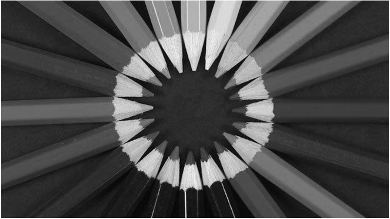

2. Adım +

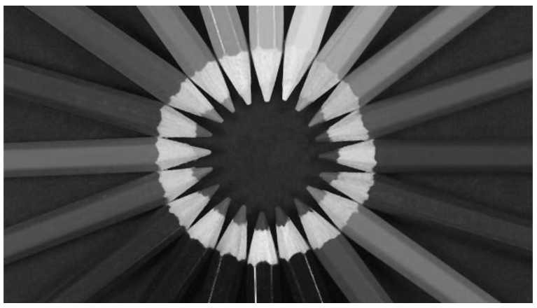

Son Adım +

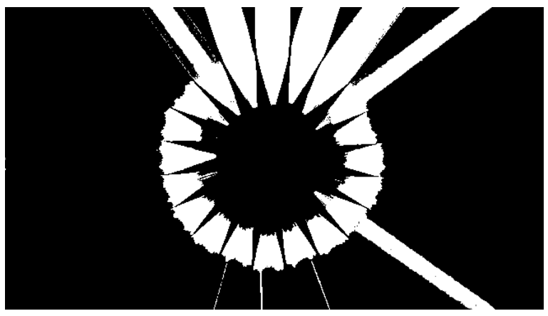

== 6) Referanslar +
. http://www.labbookpages.co.uk/software/imgProc/otsuThreshold.html#examples
. http://www.cescript.com/2012/07/otsu-metodu-ile-adaptif-esikleme.html
. http://www.atasoyweb.net/Otsu-Esik-Belirleme-Metodu

